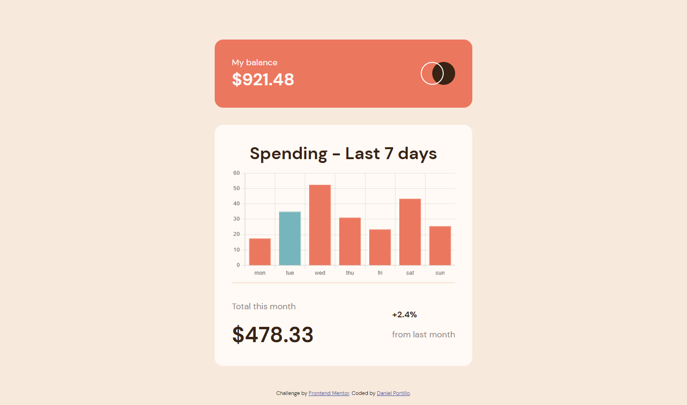
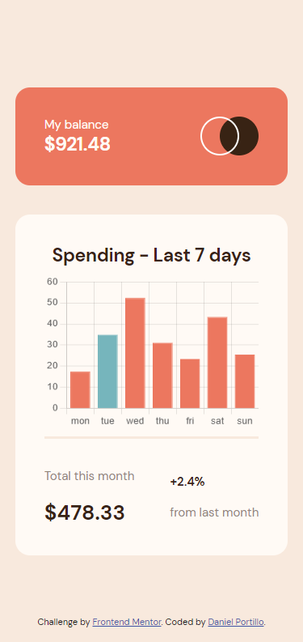
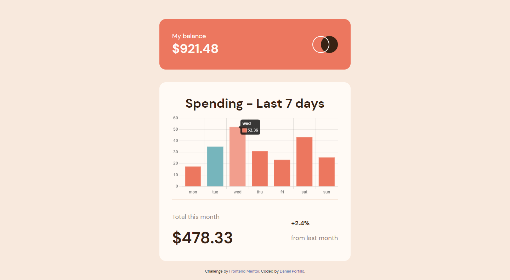

# Frontend Mentor - Expenses chart component solution

This is a solution to the [Expenses chart component challenge on Frontend Mentor](https://www.frontendmentor.io/challenges/expenses-chart-component-e7yJBUdjwt). Frontend Mentor challenges help you improve your coding skills by building realistic projects. 

## Table of contents

- [Overview](#overview)
  - [The challenge](#the-challenge)
  - [Screenshot](#screenshot)
  - [Links](#links)
- [My process](#my-process)
  - [Built with](#built-with)
  - [What I learned](#what-i-learned)
  - [Continued development](#continued-development)
  - [Useful resources](#useful-resources)
- [Author](#author)

## Overview

### The challenge

Users should be able to:

- View the bar chart and hover over the individual bars to see the correct amounts for each day
- See the current day’s bar highlighted in a different colour to the other bars
- View the optimal layout for the content depending on their device’s screen size
- See hover states for all interactive elements on the page
- **Bonus**: Use the JSON data file provided to dynamically size the bars on the chart

### Screenshot





### Links

- Repository URL: [Repository](https://github.com/dportillo23/expenses-chart-component-main)
- Live Site URL: [Live Demo](https://dportillo23.github.io/expenses-chart-component-main/)

## My process

### Built with

- Semantic HTML5 markup
- CSS custom properties
- Flexbox
- [Chart-js](https://www.chartjs.org/)
- Mobile-first workflow

### What I learned

I learned about chart-js library, very useful and easy to use and setup for simple charts like this one.

This small function is the one that puts the different color in todays bar.


```js
const backgroundColors = Array.apply(null, Array(7)).map((_, i) => i === today ? secondaryColor : primaryColor)

```

### Continued development

Chart-js is a simple library to make charts, I would like to keep learning about it, to be able to design and develop completely dynamic dashboards.


### Useful resources

- [Chart-js](https://www.chartjs.org/) - Very good documentation about this library.


## Author

- Website - [Daniel Portillo](https://www.danielportillo.dev)
- Frontend Mentor - [@dportillo23](https://www.frontendmentor.io/profile/dportillo23)
- Twitter - [@DaniDev23](https://twitter.com/DaniDev23)

